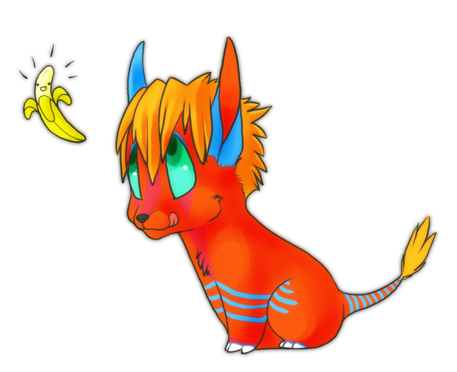

# Shadowlack Core Book

**Shadowlack** is a free game and imaginary fictional world setting (geofiction) that revolves around the planet Ramath-lehi. We utilize [Wiki.js](https://wiki.js.org/) to aid and foster constructed world collaboration among our players.

## Contributors

## License

The content of this project is licensed under the Attribution-NonCommercial-ShareAlike 4.0 International (CC BY-NC-SA 4.0) license.

## Links 🔗

- [Shadowlack Wiki](https://wiki.shadowlack.com)
- [Shadowlack](https://shadowlack.com)